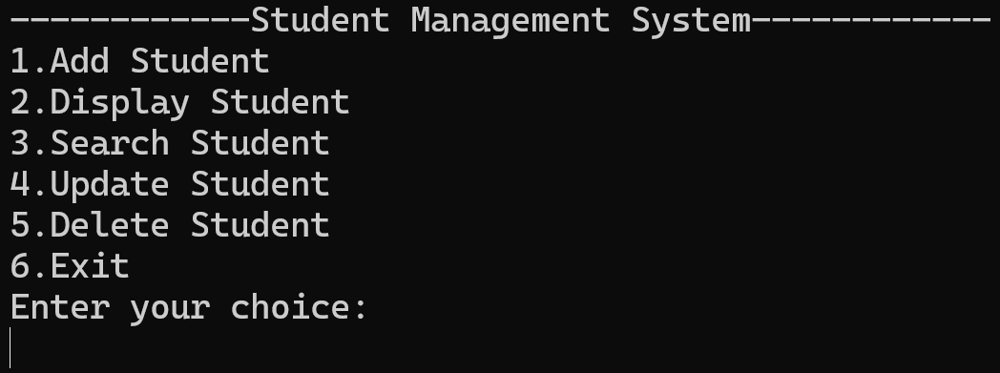
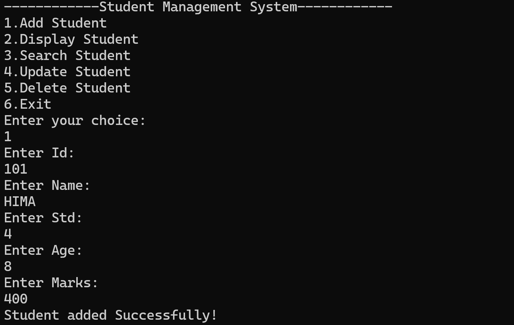
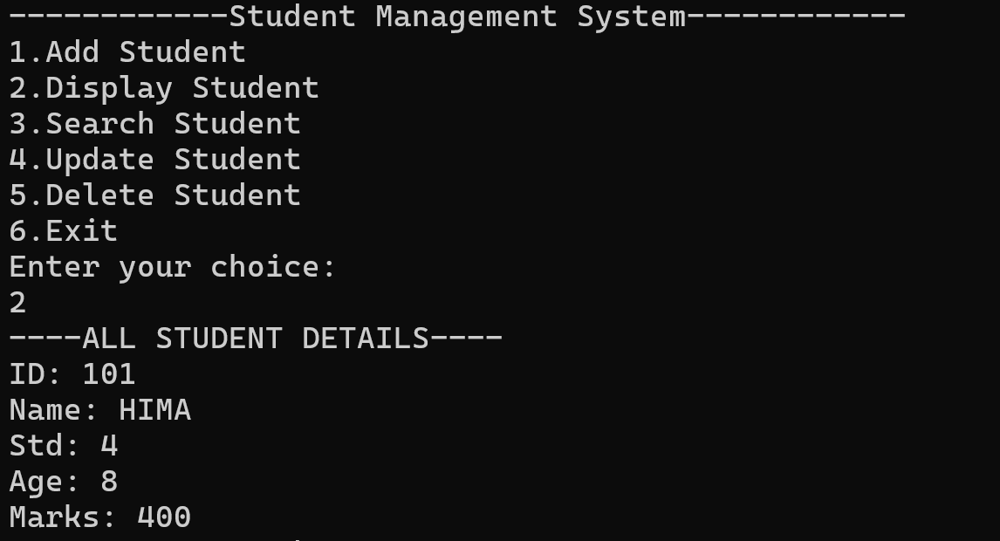
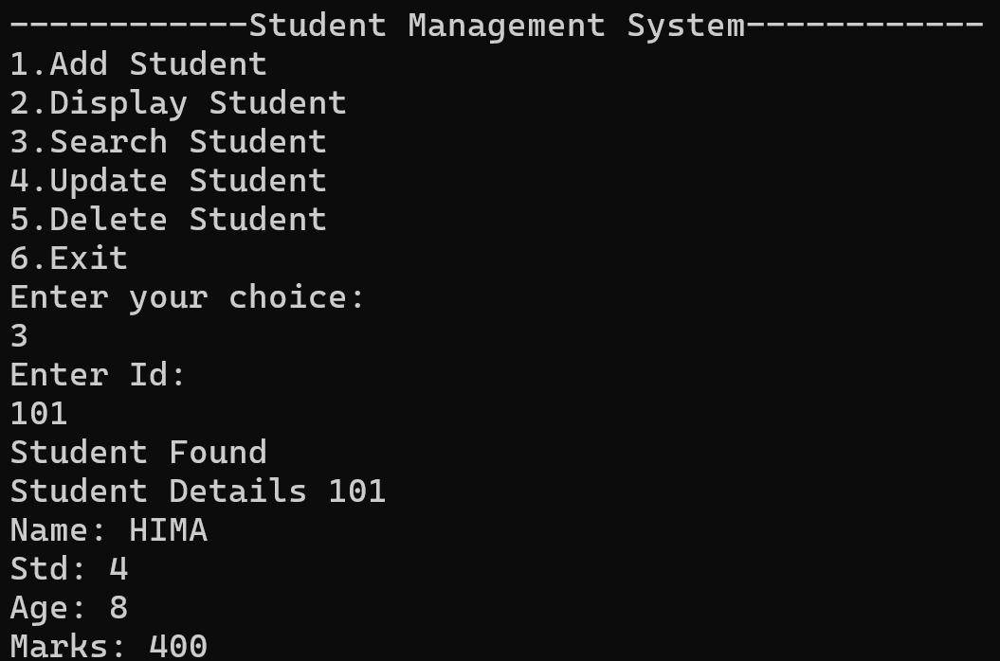
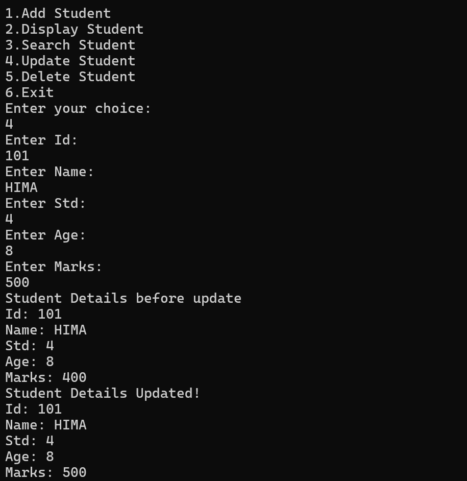
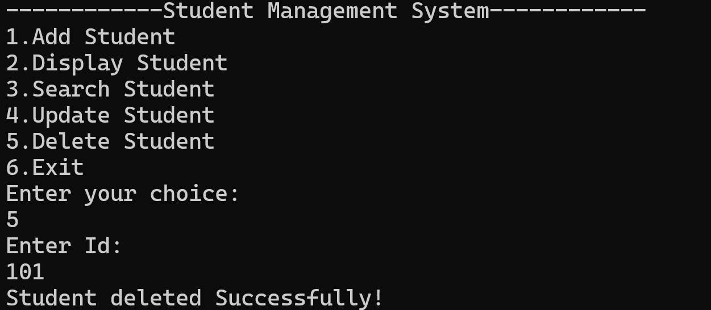
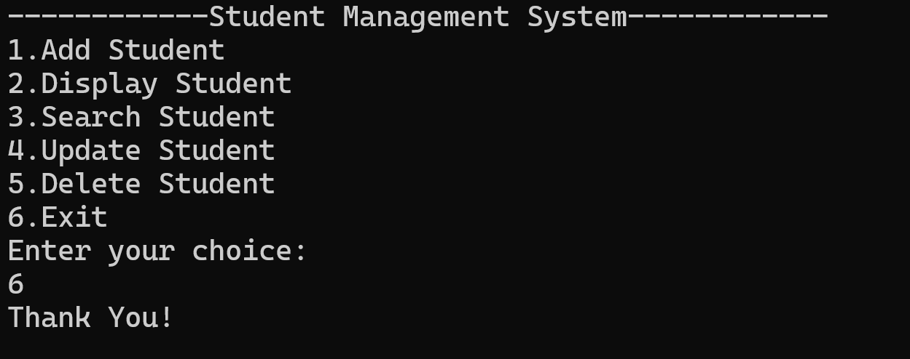

# 🎓 Student Management System (Java)

## 📌 Overview

The **Student Management System** is a Java-based console application designed to simplify the management of student records. It allows users to perform essential operations such as adding, viewing, updating, and deleting student information through an interactive menu-driven interface.

This project was developed to strengthen my understanding of **Java programming**, **Object-Oriented Programming (OOP)** concepts, and **CRUD (Create, Read, Update, Delete)** operations.

---

## ✨ Features

* ➕ Add new student records
* 📋 View all student records
* ✏️ Update existing student information
* 🗑️ Delete student records
* 🔍 Search for a student *(if implemented)*
* 📌 Menu-driven console interface
* ✅ Simple and user-friendly design

---

## 🛠️ Technologies Used

* **Java**
* Object-Oriented Programming (OOP)
* Console-Based Application

---

## 📂 Project Structure

```text
Student-Management-System/
│── src/
│── README.md
└── .gitignore
```

---

## 🚀 Getting Started

### Prerequisites

* Java JDK 8 or later
* Any Java IDE (IntelliJ IDEA, Eclipse, VS Code) or Command Prompt

### Run the Project

1. Clone the repository:

```bash
git clone https://github.com/jgurupreethi19/Student-Management-System.git
```

2. Open the project in your preferred Java IDE.

3. Compile and run the `Main.java` file.

---

## 💡 Concepts Demonstrated

* Java Programming
* Classes and Objects
* Encapsulation
* Methods
* Loops and Conditional Statements
* User Input Handling
* Basic Data Management

---

## 🎯 Learning Outcomes

Through this project, I gained hands-on experience in:

* Developing a menu-driven Java application
* Applying Object-Oriented Programming principles
* Writing clean and organized code
* Implementing CRUD operations
* Improving problem-solving and logical thinking skills

---
## Screenshots

### Main Menu


### Add Student


### Display Students


### Search Student


### Update Student


### Delete Student


### Exit



## 🔮 Future Enhancements

* Store data using MySQL or SQLite
* Build a graphical user interface (GUI) using Java Swing or JavaFX
* Export student records to CSV or PDF
* Add user authentication
* Improve search and filtering capabilities

---

## 👩‍💻 Author

**J GURUPREETHI**

**GitHub: https://github.com/jgurupreethi19**

If you found this project useful, feel free to ⭐ the repository.
