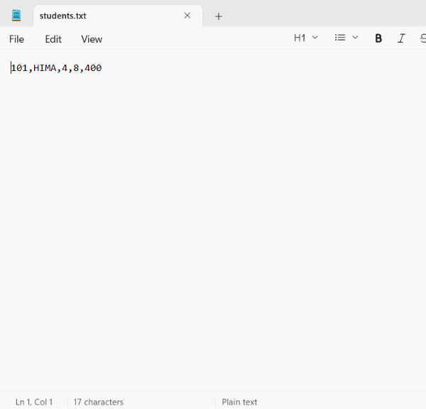

# 🎓 Student Management System (Java)

## 📌 Overview

The **Student Management System** is a Java-based console application designed to simplify the management of student records. It allows users to perform essential operations such as adding, viewing, updating, and deleting student information through an interactive menu-driven interface.

This project was developed to strengthen my understanding of **Java programming**, **Object-Oriented Programming (OOP)** concepts, and **CRUD (Create, Read, Update, Delete)** operations.

---

## ✨ Features
- ➕ Add Student
- 📋 Display All Students
- 🔍 Search Student by ID
- ✏️ Update Student Details
- 🗑️ Delete Student Record
- 💾 Save Student Data to File
- 📂 Load Student Data Automatically
- ✅ Input Validation
- ⚠️ Exception Handling
- 🔄 Data Persistence using File Handling


---

## 🛠️ Technologies Used

* **Java**
* Object-Oriented Programming (OOP)
* Console-Based Application
* ArrayList
* File Handling (File, FileWriter, Scanner)
* Exception Handling
* Input Validation
---

## 📂 Project Structure

```text
student-management-system/
│── Main.java
│── Student.java
│── StudentManagement.java
│── students.txt

```

---

## 🚀 Getting Started

### Prerequisites

* Java JDK 8 or later
* Any Java IDE (IntelliJ IDEA, Eclipse, VS Code) or Command Prompt

### Run the Project

1. Clone the repository:

```bash
git clone https://github.com/jgurupreethi19/Student-Management-System.git
```

2. Open the project in your preferred Java IDE.

3. Compile and run the `Main.java` file.

---

## 💡 Concepts Demonstrated
 * Classes & Objects
 * Constructors
 * Encapsulation
- ArrayList
- Loops
- Methods
- File Handling
- Exception Handling
- Input Validation
- Collections Framework


---
## 🎯 Learning Outcomes

Through this project, I gained practical experience in:

* Developing a CRUD application in Java
* Applying Object-Oriented Programming concepts
* Implementing file handling for data persistence
* Using collections like ArrayList
* Handling exceptions effectively
* Validating user input
* Writing modular and maintainable code

---
## Screenshots

### Main Menu


### Add Student


### Display Students


### Search Student


### Update Student


### Delete Student


### Exit

### students.txt



## 🔮 Future Enhancements

* Login Authentication
* GUI using Java Swing or JavaFX
* Database Integration (MySQL)
* Export Data to CSV
* Sorting and Filtering Students

---

## 👩‍💻 Author

**J GURUPREETHI**
* Java Developer
* Python Programmer
* SQL Enthusiast

---
**GitHub: https://github.com/jgurupreethi19**

⭐ If you found this project helpful, consider giving it a **Star** on GitHub!
